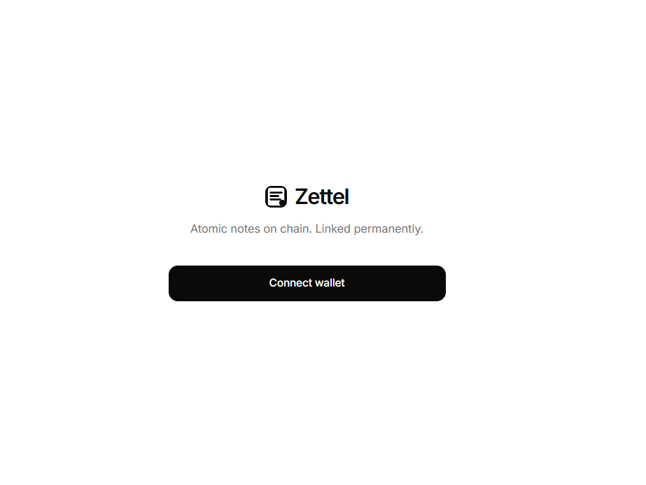
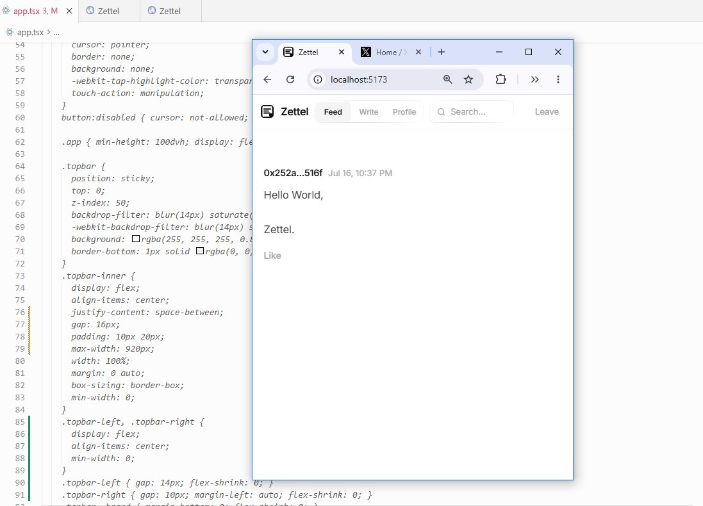

# Zettel

On-chain zettelkasten. Atomic notes, permanently linked.





## What it is

Zettel is a single-file web app for writing short notes that live on Ethereum. Posts, replies, and likes are stored on chain. No platform can delete them.

Everything lives in one file: `app.tsx`.

## Run locally

```bash
npx tsx app.tsx
```

Open [http://localhost:5173](http://localhost:5173). Reading the feed comes from Ethereum; a wallet is only needed to publish, reply, or like.

You need MetaMask (or another wallet) on **Ethereum mainnet** for write actions. The maintainer deploys the secure shared feed contract once and pays its one-time deployment gas fee.

Before launch, put the deployed contract address and deployment block into `ZETTEL_FEED` and `ZETTEL_FROM_BLOCK` in `app.tsx`, then publish that version. Those constants are the permanent feed locator: every frontend reads the same contract events directly from Ethereum. Local storage and the domain are never part of feed discovery. If the constants are empty, publishing is disabled rather than creating a private per-user feed.

For a new deployment, open `http://localhost:5173/?setup=1`, connect the maintainer wallet, open Write, and click **Deploy canonical feed** once. Copy the displayed address and block into `app.tsx`, then restart and publish the resulting build. The temporary in-session feed is not a production locator until those constants are committed.

An older feed can be inspected explicitly with `?contract=0x...&from=...`; recovery URLs are read-only and never replace the canonical feed.

## Features

- Browse the shared on-chain feed without a wallet
- Connect a wallet only for write actions
- Publish notes up to 500 UTF-8 bytes
- Reply to posts and like notes once per wallet per post
- View your on-chain profile

The embedded contract is immutable. Deploy a new feed after updating from the original build: older feeds did not enforce one-like-per-wallet and are intentionally treated as read-only by the current frontend.

## Stack

- React 19.2.7 and viem 2.55.2, pinned and loaded from CDN inside `app.tsx`
- Embedded Solidity bytecode for a minimal note contract
- Built-in dev server (Node reads and serves the HTML block from the same file)

## License

MIT
